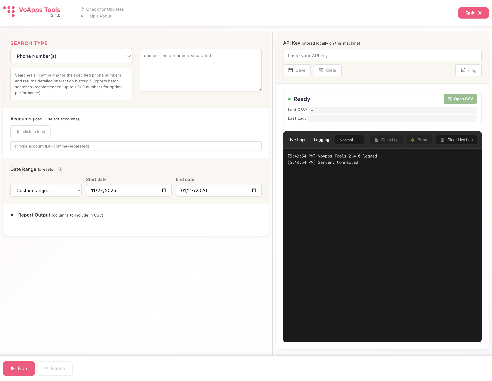
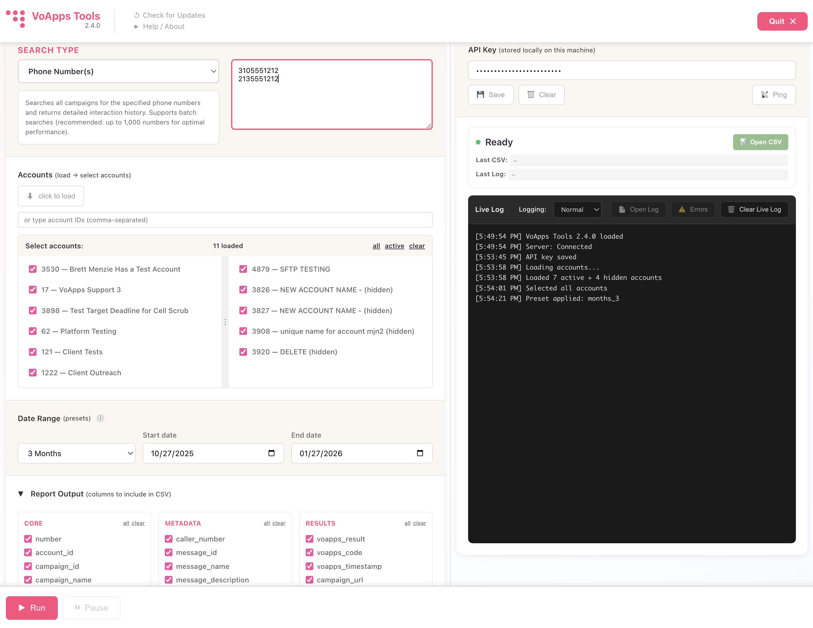
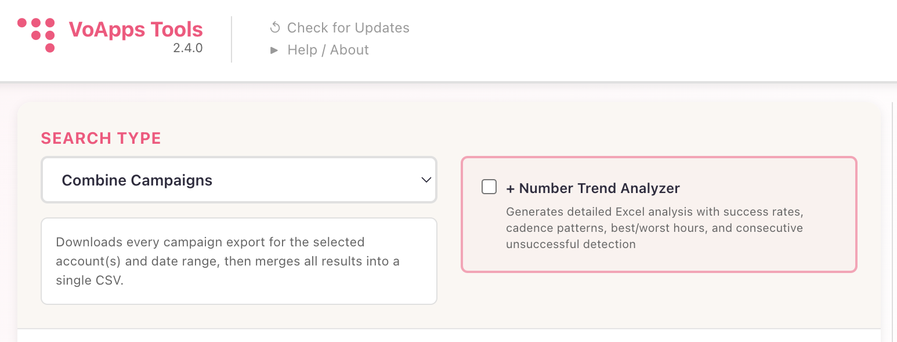
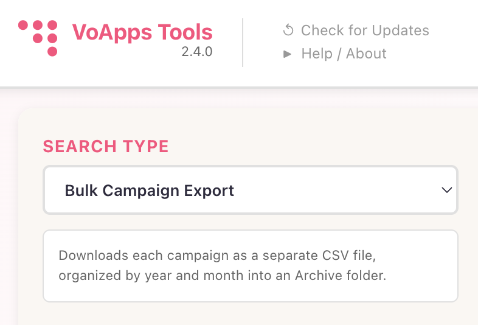
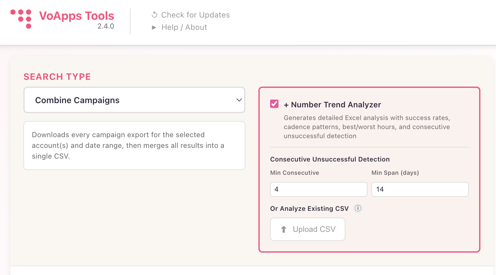
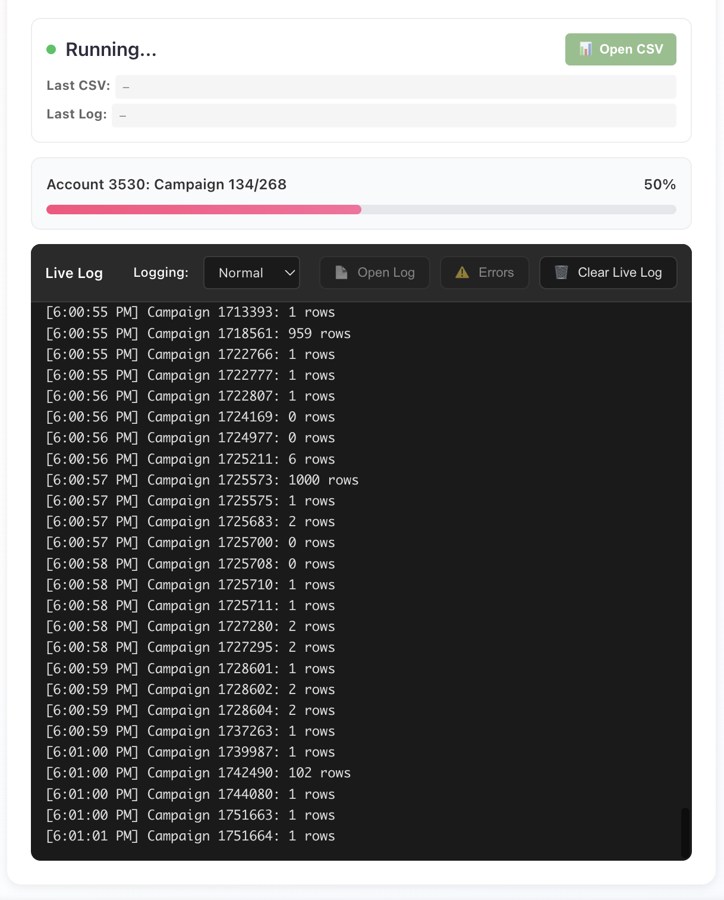
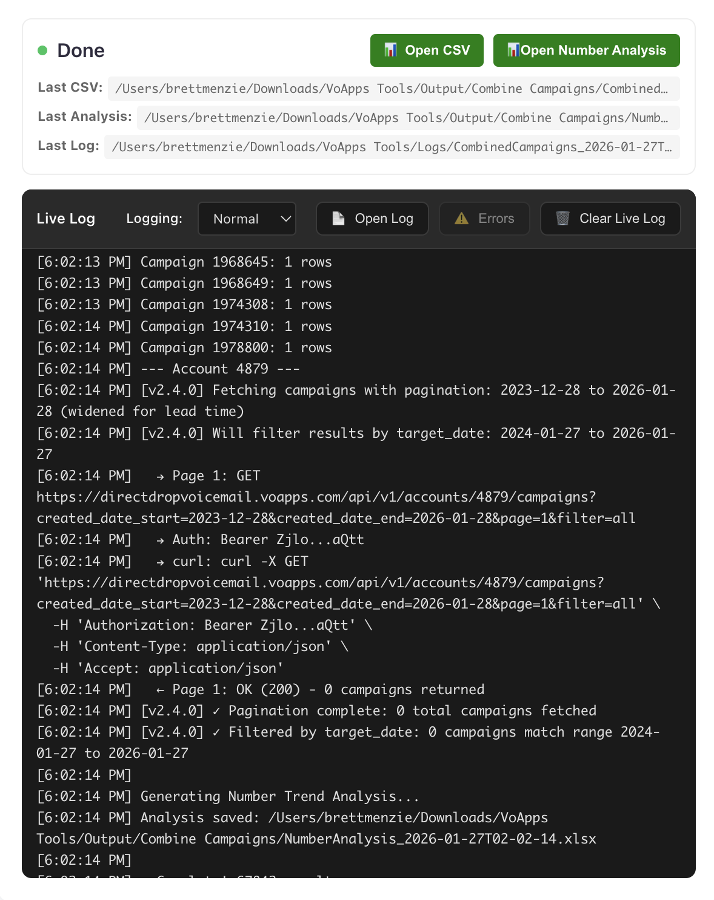
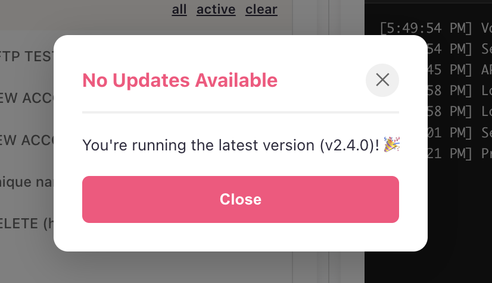

# VoApps Tools

Desktop application for searching and analyzing VoApps DirectDrop Voicemail campaign data.


## 🎯 Features

### Search & Analysis
- **📞 Phone Number Search** - Find all campaign interactions for specific phone numbers (supports batch searches up to 1,000 numbers)
- **🔄 Combine Campaigns** - Download and merge multiple campaigns into a single CSV file
- **📁 Bulk Campaign Export** - Export campaigns individually, organized by year and month
- **📊 Number Trend Analyzer** - Generate detailed Excel analysis with:
  - Success rate calculations by hour and day of week
  - Cadence pattern analysis
  - Best/worst performing time slots
  - Consecutive unsuccessful call detection
  - Configurable thresholds (min consecutive, time span)

### User Interface
- **🎨 Clean, Modern UI** - Intuitive two-panel layout with resizable sections
- **📋 Flexible Column Selection** - Choose which data fields to include in exports
- **📅 Smart Date Ranges** - Preset options (1 month, 3 months, 6 months, 1-5 years) or custom ranges
- **👥 Multi-Account Support** - Select multiple VoApps accounts, including hidden accounts
- **ℹ️ Contextual Help** - Info icons with detailed explanations for complex features
- **🔄 Auto-Update Checker** - Automatic update notifications with one-click downloads

### Technical Features
- **♾️ Pagination Support** - Handles any number of campaigns automatically
- **🔁 Intelligent Retry Logic** - 3s / 10s / 60s delays for failed API calls
- **📝 Comprehensive Logging** - Detailed API call logging with masked keys
- **💾 Settings Persistence** - All preferences saved locally between sessions
- **🛡️ Secure Storage** - API keys stored locally on your machine

## 📸 Screenshots

### Main Interface
Clean, modern two-panel layout with resizable sections and intuitive controls.



---

### Search Modes

<table>
<tr>
<td width="33%">

**Phone Number Search**

Search all campaigns for specific phone numbers with batch support up to 1,000 numbers.



</td>
<td width="33%">

**Combine Campaigns**

Merge all campaigns into a single CSV with optional Number Trend Analyzer.



</td>
<td width="33%">

**Bulk Campaign Export**

Download each campaign separately, organized by year and month.



</td>
</tr>
</table>

---

### Number Trend Analyzer

Generate comprehensive Excel analysis with success rates, cadence patterns, and consecutive unsuccessful detection.



---

### Real-Time Progress & Logging

Live progress tracking with detailed API call logging and campaign-by-campaign status updates.



---

### Completion Notifications

Desktop notifications and sound alerts when jobs complete, with direct access to results.

<table>
<tr>
<td width="50%">


</td>
<td width="50%">



</td>
</tr>
</table>

---

### Auto-Update Checker

Automatic update checking every 24 hours with one-click downloads from GitHub releases.



## 📥 Download & Installation

### Download

**Latest Version:** [v2.4.0](https://github.com/eiznem/voapps-tools/releases/latest)

Download: `VoApps Tools-2.4.0-arm64.dmg`

### System Requirements

- **macOS:** 10.13 (High Sierra) or later
- **Processor:** 
  - Apple Silicon (M1/M2/M3/M4) - Native support
  - Intel - Runs via Rosetta 2 (automatic)
- **Disk Space:** ~200 MB
- **Internet:** Required for API access

### Installation Steps

#### 1. Download the DMG
Click the download link above or visit the [Releases page](https://github.com/eiznem/voapps-tools/releases)

#### 2. Open the DMG File
Double-click `VoApps Tools-2.4.0-arm64.dmg` in your Downloads folder

#### 3. Drag to Applications
Drag the VoApps Tools icon to your Applications folder

#### 4. Remove macOS Quarantine (Required)
macOS Gatekeeper will block the app on first launch. Choose one method:

**Method A: Right-Click Open** ✅ *Recommended - Simplest*

1. Open your Applications folder
2. **Right-click** (or Control-click) on "VoApps Tools"
3. Select **"Open"** from the menu
4. Click **"Open"** in the security dialog

The app will now launch. You only need to do this once.

**Method B: Terminal Command** 🖥️ *For Advanced Users*

Open Terminal and run:
```bash
xattr -d com.apple.quarantine "/Applications/VoApps Tools.app"
```

Then launch normally from Applications.

#### 5. First Launch
The app will:
- Start a local server automatically
- Show the main interface
- Be ready for your API key

### Troubleshooting Installation

#### "Cannot open because developer cannot be verified"
This is normal for apps distributed outside the Mac App Store. Follow Method A or B above.

#### "The application is damaged"
This usually means the quarantine attribute is still set. Use Method B (Terminal command).

#### App won't start
1. Make sure you're on macOS 10.13 or later
2. Try the Terminal command method
3. Check Console.app for error messages
4. [Open an issue](https://github.com/eiznem/voapps-tools/issues) with details

#### Intel Mac Performance
Intel Macs run the app through Rosetta 2 (automatic). Performance is excellent - you won't notice a difference.

### Updating

VoApps Tools checks for updates automatically every 24 hours. When an update is available:
1. You'll see a notification
2. Click "Download Update"
3. Install the new DMG file
4. Replace the old version

Or check manually: Click **"🔄 Check for Updates"** in the app header.

### Uninstalling

To remove VoApps Tools:
1. Quit the app
2. Drag "VoApps Tools" from Applications to Trash
3. Empty Trash
4. (Optional) Remove data: `~/Downloads/VoApps Tools/`

## 🚀 First-Time Setup

After installation, follow these steps to get started:

### 1. Get Your API Key
1. Log into your [VoApps account](https://voapps.com)
2. Navigate to **Settings → API**
3. Generate a new API key or copy your existing key

### 2. Launch VoApps Tools
- Open from Applications folder
- The app will start a local server automatically
- You'll see the main interface

### 3. Configure API Connection
1. Paste your API key in the "API Key" field
2. Click **💾 Save**
3. Click **📡 Ping** to verify connection

You should see "Ping: OK" in the Live Log.

### 4. Load Your Accounts
1. Click **⬇ click to load** under Accounts
2. Select the accounts you want to search
3. Or manually enter account IDs (comma-separated)

### 5. Set Date Range
- Use preset dropdown (1 Month, 3 Months, 6 Months, etc.)
- Or select custom start/end dates

### 6. Choose Search Type
- **Phone Number(s)** - Search for specific numbers
- **Combine Campaigns** - Merge all campaigns into one CSV
- **Bulk Campaign Export** - Download campaigns separately

### 7. Run Your First Search
1. Click **▶ Run** / **▶ Combine** / **▶ Export**
2. Monitor progress in Live Log
3. Wait for completion notification
4. Click **📊 Open CSV** to view results

That's it! You're ready to analyze your VoApps campaigns.

## 📊 Number Trend Analyzer

The Number Trend Analyzer generates a comprehensive Excel workbook with five worksheets:

### Worksheets

1. **Summary** - Overview statistics and key metrics
2. **Hourly Analysis** - Success rates by hour of day
3. **Daily Analysis** - Success rates by day of week
4. **Call Cadence** - Time intervals between calls to same number
5. **Consecutive Unsuccessful** - Numbers with multiple failed attempts

### Using Trend Analyzer

**With New Data:**
1. Select "Combine Campaigns" search type
2. Check "✓ + Number Trend Analyzer"
3. Configure thresholds (optional)
4. Run combine operation
5. Click "📊 Open Number Analysis" when complete

**With Existing CSV:**
1. Select "Combine Campaigns" search type
2. Check "✓ + Number Trend Analyzer"
3. Click "⬆ Upload CSV"
4. Select your CSV file
5. Analysis generates automatically

### Thresholds

- **Min Consecutive:** Minimum consecutive unsuccessful calls to flag (default: 4)
- **Min Span (days):** Minimum time span for consecutive calls (default: 14 days)

## 📂 Output Locations

All outputs are saved to `~/Downloads/VoApps Tools/`:
```
~/Downloads/VoApps Tools/
├── Logs/
│   ├── voapps_log_YYYY-MM-DD_HH-MM-SS.txt
│   └── voapps_errors_YYYY-MM-DD_HH-MM-SS.txt
├── Output/
│   ├── Phone Number History/
│   │   └── phone_search_YYYY-MM-DD_HH-MM-SS.csv
│   ├── Combine Campaigns/
│   │   ├── combined_YYYY-MM-DD_HH-MM-SS.csv
│   │   └── number_analysis_YYYY-MM-DD_HH-MM-SS.xlsx
│   └── Bulk Campaign Export/
│       └── Archive/
│           └── YYYY/
│               └── MM/
│                   └── campaign_name_YYYY-MM-DD.csv
```

## 🔧 Advanced Features

### Date Range Buffers

VoApps Tools automatically adds buffers to ensure complete data retrieval:
- **Start date:** -30 days (captures pre-scheduled campaigns)
- **End date:** +1 day (accounts for UTC timezone conversion)

Results are then filtered by exact target_date to give you precisely what you requested.

### Timezone Handling

- All date selections are treated as **UTC midnight (00:00:00Z)**
- VoApps uses `-07:00` constant offset for daily cut times
- Each account can have its own timezone setting (check account config)

### Report Output Columns

Customize which columns appear in your CSV exports:

**Core Columns:**
- number, account_id, campaign_id, campaign_name

**Metadata Columns:**
- caller_number, message_id, message_name, message_description

**Result Columns:**
- voapps_result, voapps_code, voapps_timestamp, campaign_url

### Logging Levels

- **None** - Disable logging
- **Minimal** - Errors and critical events only
- **Normal** - Standard operational logging (default)
- **Verbose** - Detailed API calls with curl commands

## 🔄 Updates

VoApps Tools automatically checks for updates once per 24 hours. You'll be notified when a new version is available.

**Manual Check:**
- Click "🔄 Check for Updates" in the header
- View release notes and download new version

## 🐛 Troubleshooting

### API Connection Issues

**"ERROR: No API key"**
- Ensure you've entered and saved your API key
- Click "💾 Save" after pasting

**"ERROR: Failed to fetch campaigns"**
- Click "📡 Ping" to verify connection
- Check API key is valid in VoApps dashboard
- Verify internet connection

### No Results Found

**"0 results found"**
- Verify date range includes campaign activity
- Check selected accounts are correct
- Ensure phone numbers are formatted correctly (10 digits)

### macOS Security

**"Cannot open because developer cannot be verified"**
- Follow installation instructions above
- Use right-click → Open method
- Or run Terminal command to remove quarantine

### Performance Issues

**Slow searches**
- Reduce date range
- Select fewer accounts
- Disable verbose logging

## 📖 Documentation

- **[FIRST_TIME_SETUP.md](FIRST_TIME_SETUP.md)** - macOS installation guide
- **[RELEASE_NOTES_v2.4.0.md](RELEASE_NOTES_v2.4.0.md)** - What's new in v2.4.0
- **[TREND_ANALYZER_INTEGRATION.md](TREND_ANALYZER_INTEGRATION.md)** - Trend analyzer details
- **[GITHUB_AUTO_UPDATE_SETUP.md](GITHUB_AUTO_UPDATE_SETUP.md)** - For developers
- **[PACKAGING_GUIDE.md](PACKAGING_GUIDE.md)** - Build instructions

## 💻 Development

### Prerequisites

- Node.js 16 or later
- npm 7 or later
- macOS for building DMG

### Setup
```bash
# Clone repository
git clone https://github.com/eiznem/voapps-tools.git
cd voapps-tools

# Install dependencies
npm install

# Run in development mode
npm start
```

### Building
```bash
# Build DMG for distribution
npm run build

# Output: dist/VoApps Tools-2.4.0-arm64.dmg
```

### Project Structure
```
voapps-tools/
├── public/
│   └── index.html      # Main UI
├── main.js             # Electron main process
├── preload.js          # Electron preload bridge
├── server.js           # Express server & VoApps API integration
├── trendAnalyzer.js    # Excel analysis generation
└── package.json        # Dependencies & build config
```

## 🤝 Contributing

Contributions are welcome! Please feel free to submit a Pull Request.

### Development Workflow

1. Fork the repository
2. Create a feature branch (`git checkout -b feature/amazing-feature`)
3. Commit your changes (`git commit -m 'Add amazing feature'`)
4. Push to the branch (`git push origin feature/amazing-feature`)
5. Open a Pull Request

### Reporting Issues

Found a bug? Have a feature request?
- [Open an issue](https://github.com/eiznem/voapps-tools/issues)
- Include: OS version, VoApps Tools version, steps to reproduce

## 📄 License

This project is licensed under the MIT License - see the [LICENSE](LICENSE) file for details.

## ⚖️ Disclaimer

This software is provided "as is" without warranty of any kind. The author is not liable for any damages arising from the use of this software.

VoApps™ and DirectDrop™ are trademarks of their respective owners. This software is an independent tool and is not officially affiliated with or endorsed by VoApps.

## 👤 Author

**Brett Menzie**

- GitHub: [@eiznem](https://github.com/eiznem)
- Email: brett@voapps.com

## 🙏 Acknowledgments

- Built with [Electron](https://www.electronjs.org/)
- Excel generation powered by [ExcelJS](https://github.com/exceljs/exceljs)
- API integration with [VoApps DirectDrop](https://voapps.com/)

---

**Version:** 2.4.0  
**Last Updated:** January 2026

---

## 📊 Quick Links

- [Latest Release](https://github.com/eiznem/voapps-tools/releases/latest)
- [Changelog](https://github.com/eiznem/voapps-tools/releases)
- [Issues](https://github.com/eiznem/voapps-tools/issues)
- [Discussions](https://github.com/eiznem/voapps-tools/discussions)